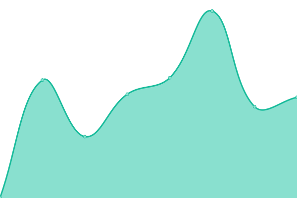
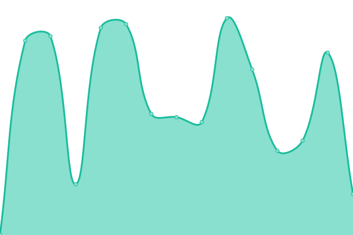
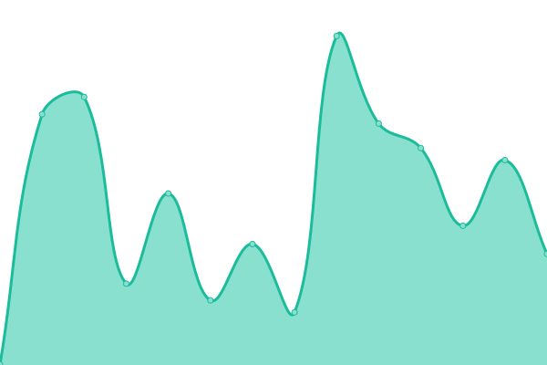

# [📈 Live Status](https://upptime.github.io/upptime): <!--live status--> **🟧 Partial outage**

This repository contains the open-source uptime monitor and status page for [Upptime](https://upptime.js.org), powered by [Upptime](https://github.com/upptime/upptime).

With [Upptime](https://upptime.js.org), you can get your own unlimited and free uptime monitor and status page, powered entirely by a GitHub repository. We use [Issues](https://github.com/upptime/upptime/issues) as incident reports, [Actions](https://github.com/xcgc/status-page/actions) as uptime monitors, and [Pages](https://upptime.github.io/upptime) for the status page.

<!--start: status pages-->
<!-- This summary is generated by Upptime (https://github.com/upptime/upptime) -->
<!-- Do not edit this manually, your changes will be overwritten -->
<!-- prettier-ignore -->
| URL | Status | History | Response Time | Uptime |
| --- | ------ | ------- | ------------- | ------ |
|  [Catto-Pro Main Site](https://catto.pictures) | 🟩 Up | [catto-pro-main-site.yml](https://github.com/xcgc/status-page/commits/HEAD/history/catto-pro-main-site.yml) | 

 366ms
     
 | 

<a href="https://xcgc.github.io/status-page/history/catto-pro-main-site">100.00%</a>
    

|  [Catto-Pro API](https://api.catto.pictures) | 🟩 Up | [catto-pro-api.yml](https://github.com/xcgc/status-page/commits/HEAD/history/catto-pro-api.yml) | 

 398ms
     
 | 

<a href="https://xcgc.github.io/status-page/history/catto-pro-api">100.00%</a>
    

|  [Catto-Pro SG API](https://sg.upload.catto.pro/healthcheck) | 🟥 Down | [catto-pro-sg-api.yml](https://github.com/xcgc/status-page/commits/HEAD/history/catto-pro-sg-api.yml) | 

 0ms
     
 | 

<a href="https://xcgc.github.io/status-page/history/catto-pro-sg-api">0.00%</a>
    

|  [Catto-Pro AU API](https://au.upload.catto.pro/healthcheck) | 🟥 Down | [catto-pro-au-api.yml](https://github.com/xcgc/status-page/commits/HEAD/history/catto-pro-au-api.yml) | 

 0ms
     
 | 

<a href="https://xcgc.github.io/status-page/history/catto-pro-au-api">0.00%</a>
    

|  [Catto-Pro DNS](https://dns.catto.pictures/healthcheck) | 🟩 Up | [catto-pro-dns.yml](https://github.com/xcgc/status-page/commits/HEAD/history/catto-pro-dns.yml) | 

 374ms
     
 | 

<a href="https://xcgc.github.io/status-page/history/catto-pro-dns">100.00%</a>
    

|  [Catto-Pro Upload API](https://upload.catto.pictures/healthcheck) | 🟩 Up | [catto-pro-upload-api.yml](https://github.com/xcgc/status-page/commits/HEAD/history/catto-pro-upload-api.yml) | 

 384ms
     
 | 

<a href="https://xcgc.github.io/status-page/history/catto-pro-upload-api">100.00%</a>
    

<!--end: status pages-->

[**Visit our status website →**](https://xcgc.github.io/status-page)

## 📄 License

- Powered by: [Upptime](https://github.com/upptime/upptime)
- Code: [MIT](./LICENSE) © [Upptime](https://upptime.js.org)
- Data in the `./history` directory: [Open Database License](https://opendatacommons.org/licenses/odbl/1-0/)
